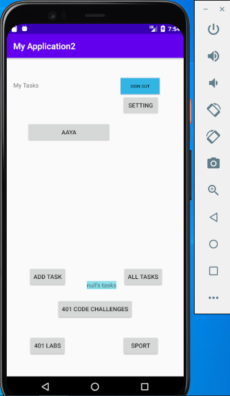

# TaskMaster2
## lab 26
### The main page  
 should have a heading at the top of the page, an image to mock the “my tasks” view, and buttons at the bottom of the page to allow going to the “add tasks” and “all tasks” page.

### Add a Task
On the “Add a Task” page, allow users to type in details about a new task, specifically a title and a body. When users click the “submit” button, show a “submitted!” label on the page.

### All Tasks
The all tasks page should just be an image with a back button; it needs no functionality.
 
 ## lab 27
 
### Task Detail Page
Create a Task Detail page. It should have a title at the top of the page, and a Lorem Ipsum description.

### Settings Page
Create a Settings page. It should allow users to enter their username and hit save.

### Homepage
The main page should be modified to contain three different buttons with hardcoded task titles. When a user taps one of the titles, it should go to the Task Detail page, and the title at the top of the page should match the task title that was tapped on the previous page.

The homepage should also contain a button to visit the Settings page, and once the user has entered their username, it should display “{username}’s tasks” above the three task buttons.

## lab 28
*refactor  homepage to look snazzy, with a RecyclerView full of Task data.
## Homepage
Refactor your homepage to use a RecyclerView for displaying Task data. This should have hardcoded Task data for now.

## home page 

## add task

## all task

## updated home page 

## labs page

## codechallenges page 

## sport page

## setting page 

## updated home page 

## lab 29
Saving Data with Room

**Feature Tasks**
1. **Task Model and Room**
- Following the directions provided in the Android documentation, set up Room in your application, and modify your Task class to be an Entity.

2. **Add Task Form**
- Modify your Add Task form to save the data entered in as a Task in your local database.

3. **Homepage**
- Refactor your homepage’s RecyclerView to display all Task entities in your database.

4. **Detail Page**
- Ensure that the description and status of a tapped task are also displayed on the detail page, in addition to the title. (Note that you can accomplish this by passing along the entire Task entity, or by passing along only its ID in the intent.)

## lab 31
Espresso Testing
Add Espresso to the application, and use it to test basic functionality of the main components of my application. For example:

assert that important UI elements are displayed on the page
tap on a task, and assert that the resulting activity displays the name of that task
edit the user’s username, and assert that it says the correct thing on the homepage

## lab 32
Tasks Are Cloudy
Using the amplify add api command, create a Task resource that replicates our existing Task schema. Update all references to the Task data to instead use AWS Amplify to access your data in DynamoDB instead of in Room.

Add Task Form
Modify your Add Task form to save the data entered in as a Task to DynamoDB.

Homepage
Refactor your homepage’s RecyclerView to display all Task entities in DynamoDB.

## home page 

## lab 36
User Login
Add Cognito to your Amplify setup. Add in user login and sign up flows to your application, using Cognito’s pre-built UI as appropriate. Display the logged in user’s username somewhere relevant in your app.

User Logout
Allow users to log out of your application.

## **Lab37**

- **Feature Tasks**
    1. Uploads
       On the “Add a Task” activity, allow users to optionally select a file to attach to that task. If a user attaches a file to a task, that file should be uploaded to S3, and associated with that task.

       <!-- Implementing a File Picker in Android and copying the selected file to another location -->

    2.  Displaying Files
       On the Task detail activity, if there is a file that is an image associated with a particular Task, that image should be displayed within that activity. (If the file is any other type, you should display a link to it.)

## **Lab41**
- **Feature Tasks**
  - Adding a Task from Another Application
  - Add an intent filter to your application such that a user can hit the “share” button on a text in another application, choose TaskMaster as the app to share that image with, and be taken directly to the Add a Task activity with that text pre-selected.

